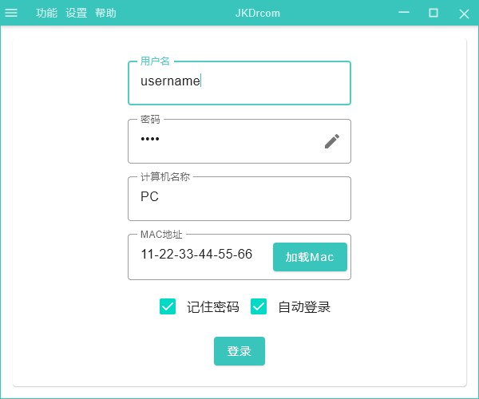

# JKDrcom

JKDrcom(JLU Kotlin Drcom)是一个从YouthLin的[jlu-drcom-java](https://github.com/YouthLin/jlu-drcom-client/tree/master/jlu-drcom-java)修改而来的第三方开源Drcom客户端实现,抽出了核心的联网功能并用Kotlin重写GUI。

## 参与进来/接手项目

本项目欢迎并感谢任何贡献、建议和反馈。

JKDrcom即将停止开发,正在寻找有意接手者,详见[Discussions#5](https://github.com/Winterreisender/JKDrcom/discussions/5)

<!--
JKDrcom已停止活跃开发,请尝试查看以下继任项目或替代项目作为推荐

| 项目                                                    | 作者              | 备注  |
|-------------------------------------------------------|-----------------|-----|
| [KJDrcom](https://github.com/AutumnTraveller/KJDrcom) | AutumnTraveller | 虚构的 |
|                                                       |                 |     |

-->

## 帮助

详见[Github Wiki](https://github.com/Winterreisender/JKDrcom/wiki)

## 引用与参考

本项目使用了以下开源软件:

| 软件                                                                                        | 许可                                                                                               |
|-------------------------------------------------------------------------------------------|--------------------------------------------------------------------------------------------------|
| [jlu-drcom-java](https://github.com/YouthLin/jlu-drcom-client/tree/master/jlu-drcom-java) | [AGPL-3.0-only](https://github.com/youthlin/jlu-drcom-client/blob/master/jlu-drcom-java/LICENSE) |
| [Kotlin](https://kotlinlang.org/)                                                         | [Apache-2.0](https://www.apache.org/licenses/LICENSE-2.0.html)                                   |
| Java ([GraalVM](https://www.graalvm.org/),[Eclipse Adoptium](https://adoptium.net/))      | [GPL-2.0-only WITH Classpath-exception-2.0](https://openjdk.java.net/legal/gplv2+ce.html)        |
| [Jetpack Compose Desktop](https://github.com/JetBrains/compose-jb/)                       | [Apache-2.0](https://www.apache.org/licenses/LICENSE-2.0.html)                                   |
| [IntelliJ IDEA Community](https://github.com/JetBrains/intellij-community)                | [Apache-2.0](https://www.apache.org/licenses/LICENSE-2.0.html)                                   |
| [flatlaf](https://www.formdev.com/flatlaf/)                                               | [Apache-2.0](https://www.apache.org/licenses/LICENSE-2.0.html)                                   |
| [Material Theme UI Lite](https://github.com/mallowigi/material-theme-ui-lite)             | [MIT](https://github.com/mallowigi/material-theme-ui-lite/blob/master/LICENSE)                   |
| [WebviewKo](https://github.com/Winterreisender/webviewko)                                 | [Apache-2.0](https://github.com/Winterreisender/webviewko/blob/master/LICENSE)                   |

---

**_以下为部分原[jlu-drcom-java](https://github.com/YouthLin/jlu-drcom-client/tree/master/jlu-drcom-java)的说明,也请详细阅读并遵守相关行为准则_**

展开

> ## 鸣谢
> 
> - 感谢 [jlu-drcom-client](https://github.com/drcoms/jlu-drcom-client) 中
> [newclient.py](https://github.com/drcoms/jlu-drcom-client/blob/master/newclient.py), 
> [drcom-android](https://github.com/drcoms/jlu-drcom-client/tree/master/drcom-android) 等
> 项目提供的前驱知识，本项目得以完成离不了前辈们的探索，致谢！
>   - 感谢[吉林大学 IBM 俱乐部副主席](https://hyec.me/)(2016-2017)在本项目期间提供的各种帮助。
> 
> ## CopyLeft
> 
> jar 可执行软件及本项目其他产出（如文档、wiki 等）采用 [ 署名 - 非商业性使用 - 相同方式共享 4.0 国际 (CC BY-NC-SA 4.0)](https://creativecommons.org/licenses/by-nc-sa/4.0/deed.zh) 
> 许可协议进行授权。
> 您可以自由地使用、修改、复制、传播本作品，
> 但是需要注明来源（链接到本页面即可）
> 并且不能用于任何商业用途；您通过本作品演绎的作品也需要遵守本协议或兼容的协议。
> 
> 此软件仅用于学习交流使用，请勿用于商业用途，
> 引用本项目的任何代码请注明出处并链接到本页面，
> 感谢您的理解与配合。
> 
> 请您在不违反 校规和/或任何有效约束 的前提下使用本软件。
> 
> ## LICENSE
> 
> 此项目源代码遵循 AGPL 协议。

## 版权与许可

Copyright 2022 Winterreisender.  
Licensed under GNU Affero General Public License Version 3 (**AGPL-3.0-only**).

This program is free software: you can redistribute it and/or modify it under the terms of the GNU Affero General Public License as published by the Free Software Foundation, version 3.  
This program is distributed in the hope that it will be useful, but WITHOUT ANY WARRANTY; without even the implied warranty of MERCHANTABILITY or FITNESS FOR A PARTICULAR PURPOSE. See the GNU Affero General Public License for more details.  
You should have received a copy of the GNU Affero General Public License along with this program. If not, see <https://www.gnu.org/licenses/>

本程序是自由软件：你可以再分发之和/或依照由自由软件基金会发布的 GNU Affero通用公共许可证修改之，仅版本 3 许可证。  
发布该程序是希望它能有用，但是并无保障;甚至连可销售和符合某个特定的目的都不保证。请参看 GNU Affero通用公共许可证，了解详情。  
你应该随程序获得一份 GNU Affero通用公共许可证的复本。如果没有，请看 <https://www.gnu.org/licenses/>。

